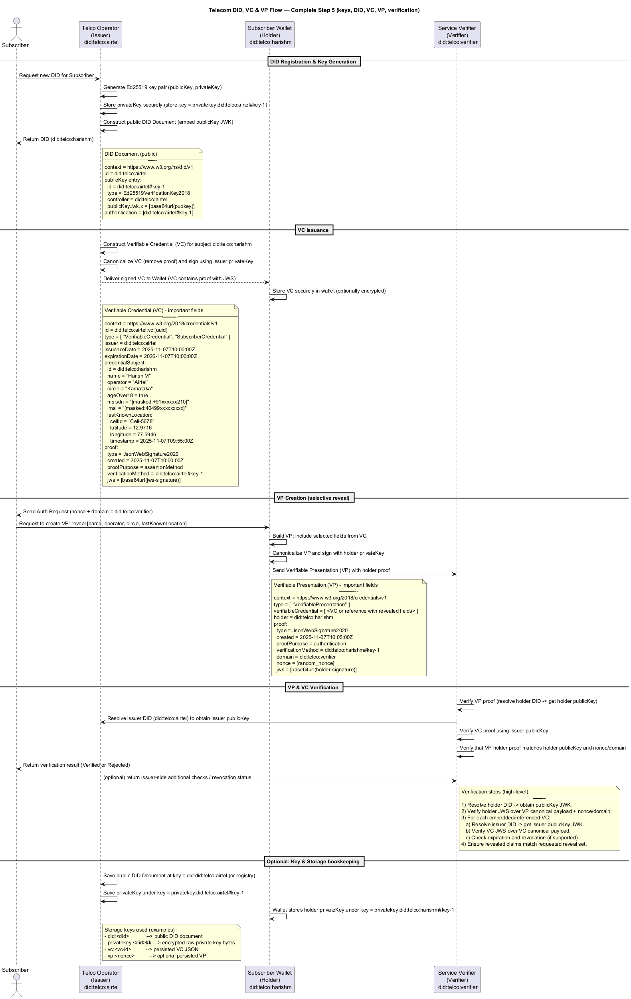

# 6G Digital Identity Wallet

## 💡 Project Overview

This repository contains the foundational implementation of a **Digital Identity Wallet** and associated **Issuer/Verifier Services** compliant with W3C Verifiable Credentials (VC) and Decentralized Identifiers (DID) standards.

The primary goal is to demonstrate a secure, privacy-preserving identity layer suitable for future 6G-era telecom services, where immutable subscriber identity and selective data disclosure are paramount. The implementation is written in Go and structured around the three core actors in a decentralized identity ecosystem: the **Issuer**, the **Holder (Wallet)**, and the **Verifier**.

---

## 🏗️ Architecture and Components

The system is organized into three logical services and four core data structures, all managed through a persistent (in-memory) store.

### Services

| Service | Role | Core Functionality |
| :--- | :--- | :--- |
| `Issuer Service` | **Telco Operator** | Generates DID Documents, creates and signs Verifiable Credentials (VCs). |
| `Wallet Service` | **Subscriber (Holder)** | Securely stores VCs, constructs and signs Verifiable Presentations (VPs) based on verifier requests. |
| `Verifier Service`| **Relying Party** | Resolves DIDs, verifies the cryptographic integrity of VPs and embedded VCs, and enforces policy checks. |

### Core Data Structures (`internal/models`)

| Structure | Description |
| :--- | :--- |
| `DIDDocument` | The public document describing the cryptographic key material associated with an identity. |
| `VerifiableCredential` (VC) | A tamper-proof claim signed by the Issuer (e.g., "This DID owns SIM X"). |
| `VerifiablePresentation` (VP)| A container created and signed by the Holder (Wallet) to selectively share VCs with a Verifier. |
| `CryptoService` | An abstract interface centralizing all key generation, signing, and verification (Ed25519/JWS). |

---

## 🔄 Digital Identity Flow

The entire lifecycle—from key generation to authentication—follows a standardized pattern.

The diagram below illustrates the sequence, highlighting the cryptographic steps taken by the Issuer (signing VCs) and the Holder (signing VPs).



---

## 🛠️ Setup and Run (Placeholder)

This section details how to get the project running.

### Prerequisites
* Go 1.21+
* The `uuid` package (`github.com/google/uuid`)

### Building the Project

```bash
# Build the main wallet server executable
go build -o bin/wallet-server.exe ./cmd/wallet-server

# Build the issuer/verifier testing executable (if applicable)
# go build -o bin/issuer-server.exe ./cmd/issuer-server